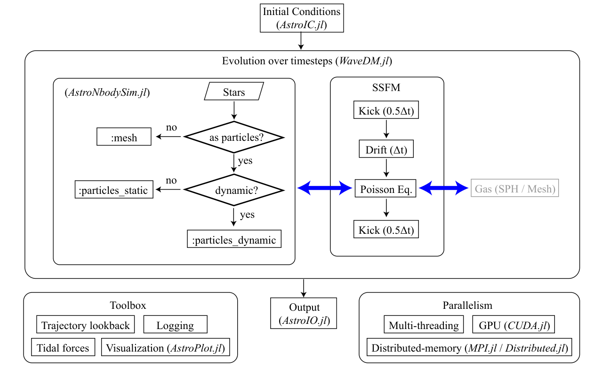

# WaveDM.jl

**WaveDM.jl: An Adaptable Simulation Framework for Dynamics of Baryonic and Wave Dark Matter on Galaxy Scales**

WaveDM.jl is an open-source Julia package for high-performance simulations of wave (fuzzy) dark matter dynamics on galaxy scales.
The code solves the time-dependent **Schrödinger–Poisson equation (SPE)** using a pseudo-spectral split-step Fourier method, with a design philosophy centered on **adaptability and extensibility**.

The spectral solver is tightly integrated with N-body gravitational force solvers, enabling simultaneous evolution of wave dark matter and baryonic components in galaxy-scale simulations.
A unified multi-level parallelization framework brings shared-memory, distributed-memory, and GPU execution into a single workflow, allowing the same code to scale from a workstation to a multi-node HPC environment without any code change.
A dedicated galaxy-simulation toolbox — built on `AstroIC.jl`, `AstroNbodySim.jl`, and `AstroPlot.jl` — bundles flexible initial condition generators, trajectory lookback, tidal force calculations, and real-time visualization.

Beyond astrophysics, the code's modular architecture supports cross-disciplinary studies in nonlinear optics and cold-atom physics through a generalized nonlinear Schrödinger interface.

## Three Key Capabilities

1. **Coupled wave + N-body evolution.** The SPE solver evolves the bosonic field $\psi$ on a uniform grid, while `AstroNbodySim.jl` simultaneously evolves baryonic particles (static or fully dynamic) and computes their gravitational coupling to the wave dark matter. Time-dependent tidal fields from a host halo and external perturbers (e.g. the LMC) are supported.
2. **Multi-level parallel execution.** Shared-memory multi-threading, distributed-memory parallelism via Julia's native `Distributed.jl`, and GPU acceleration via `CUDA.jl` are all exposed through simple keyword arguments (`-t N`, `distributed_memory=true`, `gpu=true`). The same script runs unchanged from a laptop to a multi-node cluster.
3. **Galaxy-simulation toolbox.** Ready-to-use density profiles (gNFW, NFW, Zhao), Milky-Way and SPARC initial conditions, Milky-Way satellite trajectory lookback (Battaglia 2022), MW / LMC tidal fields, on-the-fly virial and energy diagnostics, and interactive 2D/3D visualization via `GLMakie.jl` (and terminal-based `UnicodePlots.jl` for headless runs).

## Quick Start

The minimum useful script — wave CDM evolution of a Crater II-like ultra-faint dwarf:

```julia
using WaveDM
using Unitful

simulate_waveDM(;
    model       = :dwarf_UFDs,
    Galaxy_id   = 6,                # Crater II
    V           = (x, y, z, ψ) -> 0.0,  # external potential
    Nx          = 384,              # mesh size
    Xmax        = 20u"kpc",         # half-side length, L = 2*Xmax
    Tmax        = 6.0u"Gyr",
    autoset_timestep = true,
    gpu         = true,
    Realtime    = true,
)
```

See [Examples](@ref) for additional end-to-end cases (Crater II with the MW tidal field, MW+LMC trajectory lookback, distributed-memory runs, GPU performance).

## Architecture



*Figure 1 — Architecture of WaveDM.jl.* The framework integrates four core components (reproduced from the accompanying paper, Meng & Dong 2026):

1. a **pseudo-spectral split-step Fourier method (SSFM)** solver for the SPE, evolving $\psi$ with a second-order *kick–drift–kick* (KDK) scheme;
2. an optional **baryonic physics module** (`AstroNbodySim.jl`) with mesh-based and particle-based treatments (`baryon_mode = :ignored | :mesh | :particles_static | :particles_dynamic`), supporting both `DirectSum` ($\mathcal{O}(N^2)$) and `Tree` ($\mathcal{O}(N \log N)$, Gadget-2 scheme) gravity solvers;
3. a **galaxy-simulation toolbox** providing trajectory lookback, tidal-field evaluation, logging, real-time visualization (`AstroPlot.jl`), and post-processing;
4. a **multi-level parallel framework** combining multi-threading, distributed-memory (Julia's `Distributed.jl` with TCP/IP transport), and GPU acceleration (`CUDA.jl`).

Initial conditions are generated by `AstroIC.jl`; snapshot I/O is handled by `AstroIO.jl`. **Gas dynamics via SPH is planned for a future release.** MPI support is also planned as an alternative communication backend to `Distributed.jl`.

## When to use WaveDM.jl

| If you need … | WaveDM.jl provides … |
| --- | --- |
| Galaxy-scale SPE simulations with realistic halo potentials | `model = :MW`, `:dwarf`, `:dwarf_NFW`, `:dwarf_Zhao`, `:Elliptical`, `:cluster_NFW`, `:cluster_Burkert`; gNFW / NFW / Zhao / β-model / Jaffe profiles; the Milky-Way mass model (Zhu 2023); Crater II preset (`model = :dwarf_UFDs` with `target_profile_model = :dwarf_UFDs`, `Galaxy_id = 6`) |
| Tidal stripping of a satellite under a live host | `MW_tidal_field=true`, optional `LMC_tidal_field=true` |
| Backward orbital integration of a satellite | `AstroIC.load_data_MW_satellites()` + an `AstroNbodySim.Simulation` |
| Self-interacting wave dark matter ($\kappa \neq 0$) | Pluggable `V(x, y, z, ψ)` + `κ` keyword |
| Cross-disciplinary nonlinear Schrödinger problems | Pluggable potential interface — same code base for NLO, BEC |

## Documentation Navigation

- [Introduction](introduction.md) — wave dark matter background, design philosophy, ecosystem
- [Installation](installation.md) — installing WaveDM.jl and its dependencies
- [Algorithms](algorithms.md) — SPE, split-step Fourier method, boundary conditions, resolution and timestep criteria, virial diagnostics
- [API Reference](api/configs.md) — detailed API documentation
- [Examples](examples.md) — complete simulation examples
- [References](reference.md) — related literature

## Citation

If you use WaveDM.jl in your research, please cite the accompanying paper:

```bibtex
@article{MengAndDong2026WaveDMjl,
  title  = {WaveDM.jl: An Adaptable Simulation Framework for Dynamics of
            Baryonic and Wave Dark Matter on Galaxy Scales},
  author = {Run-Yu Meng and Xiao-Bo Dong},
  year   = {2026},
  journal= {arXiv preprint},
}
```

## License

WaveDM.jl is released under the **GNU General Public License v3.0 (GPL-3)**. See the [LICENSE](https://github.com/JuliaAstroSim/WaveDM.jl/blob/main/LICENSE) file for details.
